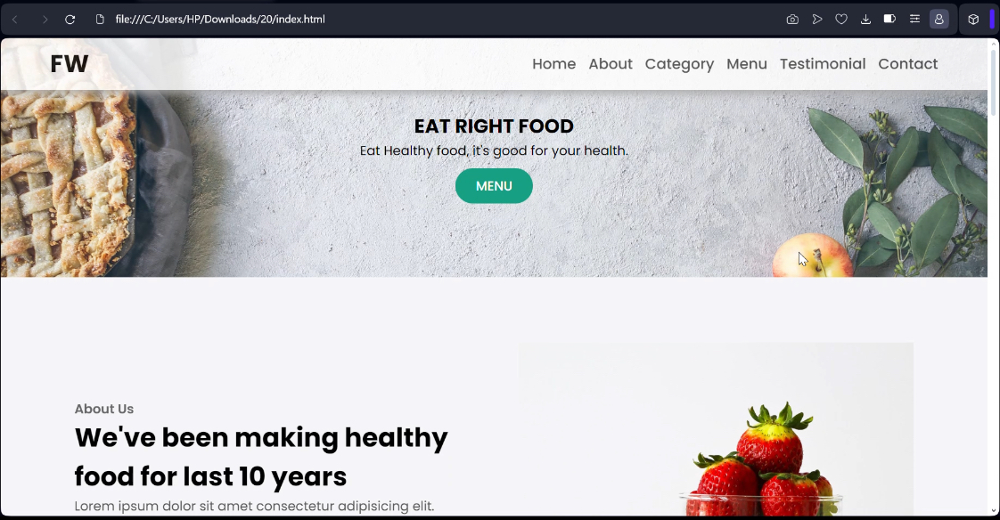

# Food Restaurant Website

Check out one of my another responsive food restaurant website! 🍽️



## Description
This is a fully responsive restaurant website, designed using HTML, CSS and JavaScript to provide an aesthetically pleasing layout across various screen sizes. It features a modern design that adapts beautifully to both desktop and mobile devices, ensuring a great user experience.

Explore the live site here: [`Food Restaurant Website`](https://foodrestaurantwebsitebyzk.netlify.app)

## Project Structure
- [`index.html`](index.html): The main html file of the website, featuring the restaurant's services, showcases the full restaurant's services and the page that allows customers to reach out for inquiries.
- [`style.css`](style.css): The CSS file for styling the website.
- [`images`](images.zip): A folder containing all images used throughout the website.

## How to View the Website
**Live Website**: You can view the live version of the website through the following link: [`Food Restaurant Website`](https://foodrestaurantwebsitebyzk.netlify.app).

### Local Development:
1. Clone the repository using the following command:
    ```bash
    git clone https://github.com/zainkashif1122/food-restaurant-website.git
    ```
2. Navigate to the project directory:
    ```bash
    cd food-restaurant-website
    ```
3. Open [`index.html`](index.html) in your web browser to view the website locally.

## Recorded Preview
Here’s how the Food Restaurant website looks and functions across various devices:

- [`Desktop View`](desktopViewScreenRecording.mp4): Experience the clean layout, responsive design, and intuitive navigation on a large screen.
- [`Mobile View`](mobileViewScreenRecording.mp4): See how the design adapts for smaller screens, offering a user-friendly interface optimized for mobile browsing.

> **Note:** The quality of these screen recordings has been reduced to comply with GitHub's 25MB file size limit.

## Technologies Used
### **Languages**:
- **HTML5**: For structuring the web pages.
- **CSS3**: For styling the pages using modern layout techniques like Flexbox and Grid.
- **JS**: For smooth scrolling of the website.

### **Softwares**:
- **Vs Code**: For compiling HTML, CSS and JAVASCRIPT code.
- **Browser**: For getting an output display of the website.

## Features
- **Responsive Design**: The layout adjusts to different screen sizes, providing a smooth experience on both desktop and mobile devices.
- **Simple Navigation**: Easy access to the restaurant’s menu and contact information.
- **Stylish Layout**: A modern design that highlights the restaurant’s offerings in a visually appealing way.

## Future Improvements
- **Booking Form**: Integrating an online reservation system.
- **SEO Optimization**: Improving search engine rankings to attract more visitors.
- **Performance Optimization**: Enhancing loading times for better performance.

## Feedback and Support
Your feedback is appreciated! Feel free to reach out if you have suggestions or questions about the website. Contributions are welcome to further improve this project.

## Stay Tuned
Stay updated for upcoming features and improvements. Follow the repository for the latest updates, and don't miss out on new releases!
